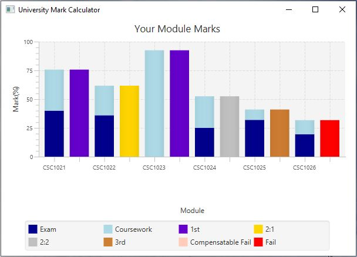

# University Mark Calculator



An application that builds a chart displaying a student's grades for their first year of Computer Science at Newcastle University.

## Run Locally
To run locally, ensure Java 8 or above is installed and run the maven command:
```bash
mvn compile exec:java
```